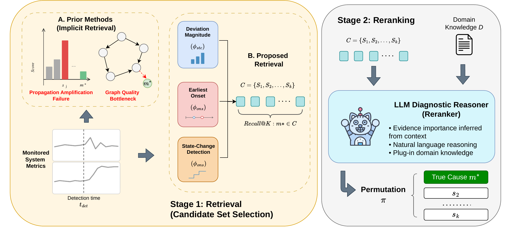

<div align="center">

# Where Root Cause Analysis Fails: A Retrieval–Reranking Decomposition

**Hada Melino Muhammad<sup>1</sup>, Luan Pham<sup>1</sup>, Laure Barrière<sup>2</sup>, Sachin Shetty<sup>2</sup>, Leonardo Pulga<sup>2</sup>, Flora D. Salim<sup>1</sup>**

<sup>1</sup>University of New South Wales &nbsp;&nbsp; <sup>2</sup>Baker Hughes

**NeurIPS 2026 · Evaluations & Datasets Track**

[](TODO_PAPER_URL)
[](TODO_ARXIV_URL)
[](LICENSE)

</div>

<p align="center">
  
</p>

**TL;DR.** Root cause analysis (RCA) is scored with top@k accuracy, which hides *where* a method fails: was the true cause never considered (**retrieval failure**), or considered but ranked too low (**reranking failure**)? We split RCA into these two stages, measure each with a metric that applies to any ranking method, and show that on industrial cyber-physical systems the two stages fail for different reasons and need different fixes.

## Highlights

- **Two metrics for any RCA method.** `Retrieval@K` (is the true cause inside the candidate set of size K?) and `Rerank@k` (given it is, is it ranked in the first k?), with **top@k = Retrieval@K × Rerank@k**. They work from a method's ranked output alone, with no access to its internals.
- **Retrieval is a hidden bottleneck on industrial systems.** Deviation magnitude puts the true cause in the top 15 for 98–100% of microservice faults, but only 35–64% of faults on WADI, SWaT and HVAC, and even retrieved causes are hard to rank there.
- **Graph-based RCA fails at both stages**, whether its causal graphs are learned on short fault windows, on candidate pools guaranteed to contain the cause, or on multi-day normal-operation data.
- **A simple two-stage pipeline** (multi-signal retriever + one listwise LLM call) matches or beats the best of nine baselines on all six benchmarks, with no causal graph or labels. When every method ranks the same candidates, adding a short system-description document puts it +7 to +18 top@1 points above the best baseline on every benchmark, a gain that end-to-end top@k hides.

## Use the metrics on your method

```python
from method.evaluation.metrics import decompose

# y_true: ground-truth causes per scenario; y_pred: your method's ranking per scenario
y_true = [["P101"], ["FIT201"]]
y_pred = [["LIT101", "P101", "MV101"], ["FIT201", "AIT202", "P201"]]

decompose(y_true, y_pred, cutoff=1, n_candidates=15)   # k=1, K=15
# {'top@1': 0.5, 'Retrieval@15': 1.0, 'Rerank@1': 0.5,
#  'retrieval_failure': 0.0, 'reranking_failure': 0.5}
```

`cutoff` is k (the ranking cutoff) and `n_candidates` is K (the candidate-set size). By default the candidate set is the first K items of each ranking. For a method with its own explicit candidate set (e.g. the nodes kept by a learned causal graph), pass `candidates_list=`. Always report K alongside both metrics.

## Installation

Python 3.10:

```bash
git clone https://github.com/cruiseresearchgroup/DecompRCA.git
cd DecompRCA
pip install -r requirements.txt
pip install --no-deps sfr-pyrca==1.0.1        # RCD, ε-Diagnosis; see note in requirements.txt

# BARO on RCAEval runs through RCAEval's own entry point:
git clone https://github.com/phamquiluan/RCAEval.git
git -C RCAEval checkout fb8f20a6763b19ebf5b8a72abe8c24de7550d122

python -m pytest tests/                      # graph-direction and CIRCA-window tests
```

LLM-reranker runs need a `.env` at the repo root with `GROQ_API_KEY`, and optionally `LANGFUSE_PUBLIC_KEY` / `LANGFUSE_SECRET_KEY` / `LANGFUSE_HOST` for tracing. The baseline runner needs no API keys.

## Data

All four benchmarks are public; we do not redistribute them.

| Dataset | Domain | Scenarios | Access |
|---|---|---|---|
| [WADI](https://itrust.sutd.edu.sg/itrust-labs_datasets/) | Water distribution | 14 attacks | iTrust request |
| [SWaT](https://itrust.sutd.edu.sg/itrust-labs_datasets/) | Water treatment | 36 attacks | iTrust request |
| [HVAC](https://doi.org/10.25984/1881324) | Building management (LBNL FDD, ORNL RTU) | 48 faults | Open (OEDI) |
| [RCAEval RE1](https://github.com/phamquiluan/RCAEval) | Microservices (OB, SS, TT) | 125 per suite | Open |

Place the raw files where the loaders expect them:

```
method/datasets/wadi/WADI_14days_new.csv, WADI_attackdataLABLE.csv
method/datasets/swat/SWaT.A1 & A2_Dec 2015/Physical/SWaT_Dataset_{Normal_v1,Attack_v0}.xlsx
method/datasets/swat/SWaT.A1 & A2_Dec 2015/List_of_attacks_Final.xlsx
method/datasets/hvac/LBNL_FDD_Data_Sets_RTU/ORNL_RTU/   (seasonal ERTU_*.csv and fault CSVs)
method/datasets/rcaeval/RE1-{OB,SS,TT}/<service>_<fault>/<instance>/{simple_data.csv or data.csv, inject_time.txt}
```

## Reproducing the paper

Set `PYTHONHASHSEED=0` for every command (CIRCA breaks score ties by set order); the runners also enforce it. Outputs land in `method/results/`.

| Paper result | Command |
|---|---|
| Table 1 (Retrieval@K), Figure 2 | `python method/runners/compute_retrieval_recall_cumulative.py`, `python method/runners/plot_retrieval_saturation.py`; HVAC row: `python -m method.experiments.hvac_pools` |
| Tables 3, 5, 6: baseline rows (WADI, SWaT, RCAEval) | `python method/runners/run_baseline.py --dataset wadi` (also `swat`, `rcaeval`) |
| Tables 3, 5: HVAC baseline rows | `python -m method.experiments.hvac_baselines` (RCD and ε-Diagnosis seeded) |
| Tables 3, 5, 6: LLM rows (WADI, SWaT, RCAEval); Table 2 combines these with Table 1 | `python method/runners/run_llm_balanced.py --dataset wadi` (RCAEval: `--dataset rcaeval --suite RE1-OB`) |
| Tables 3, 5: HVAC LLM rows | `python -m method.experiments.controlled_llm --run-llm --paper-grid` (HVAC is scored on its retriever pools, with causes the retriever misses counted as misses) |
| Table 4, Tables 10–11 (retrieval-controlled pools) | `python -m method.experiments.controlled_pools`, then `controlled_baselines`, then `controlled_llm --run-llm --paper-grid`, then `tables` |
| Tables 7–9 (same-candidate controls) | `python -m method.experiments.same_candidate` (needs the LLM runs of `run_llm_balanced.py` first) |
| Tables 12–14 (backbone, temperature, de-identification) | `python -m method.experiments.controlled_llm --run-llm --paper-grid` |
| Table 15 (detection-timestamp sensitivity) | `python -m method.experiments.tdet_sensitivity` |
| Table 16 (graphs from long normal-operation windows) | `python -m method.experiments.longwindow_graphs` |
| Tables 4 and 7–16, and the HVAC parts of Tables 1, 3, 5 | `python -m method.experiments.run_all --run-llm` (prints where each table lands) |

**Runtime.** Fitting the per-scenario and pool-restricted PC/FCI graphs takes hours, dominated by FCI on RE1-TT; fitted graphs are cached and reused on later runs.

**What reproduces exactly.** Retrieval, BARO, PageRank, RandomWalk, PC/FCI graph fitting, and CIRCA are deterministic given `PYTHONHASHSEED=0`. RCD and ε-Diagnosis are stochastic: they are seeded in the controlled pools and on HVAC, but the WADI/SWaT/RCAEval rows of Tables 3, 5 and 6 are single unseeded runs, so re-runs vary.

**LLM rows.** These need a Groq API key (`--run-llm`) and are stochastic at T=1.0, so a re-run reproduces the paper within its reported run-to-run spread. We do not release the stored LLM responses; `controlled_llm --cache-dir DIR` re-scores responses you have stored yourself without making API calls.

## Repository structure

```
method/
├── algorithms/rca/      BARO, RCD, ε-Diagnosis, CIRCA, PageRank, RandomWalk,
│                        the multi-signal retriever, and the LLM reranker
├── algorithms/cd/       PC / FCI causal discovery for the graph baselines
├── datasets/            Loaders for WADI, SWaT, HVAC, RCAEval RE1
├── evaluation/          top@k, Avg@k, Retrieval@K, Rerank@k
├── experiments/         Controlled comparisons and robustness studies (Tables 4, 7–16)
├── prompts/             Domain-knowledge documents per dataset (real and de-identified)
└── runners/             Retrieval, end-to-end baselines, and LLM reranker (Tables 1–3, 5, 6)
```

## Citation

```bibtex
@inproceedings{muhammad2026where,
  title     = {Where Root Cause Analysis Fails: A Retrieval--Reranking Decomposition},
  author    = {Muhammad, Hada Melino and Pham, Luan and Barri{\`e}re, Laure and
               Shetty, Sachin and Pulga, Leonardo and Salim, Flora D.},
  booktitle = {Advances in Neural Information Processing Systems},
  year      = {2026}
}
```

## License

Released under the [MIT License](LICENSE). The benchmarks remain under their original terms.
